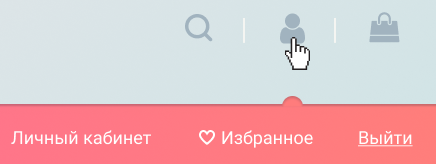
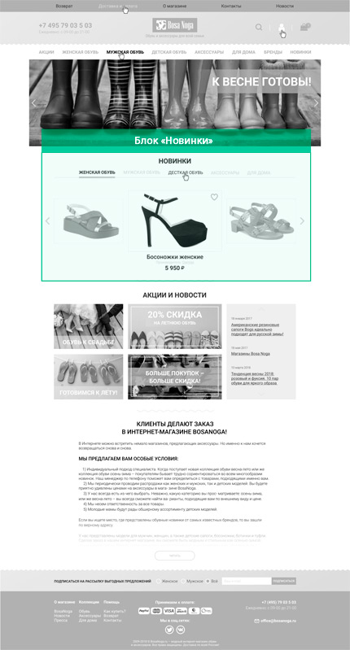
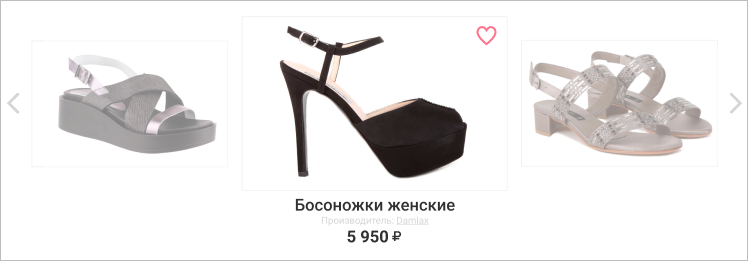
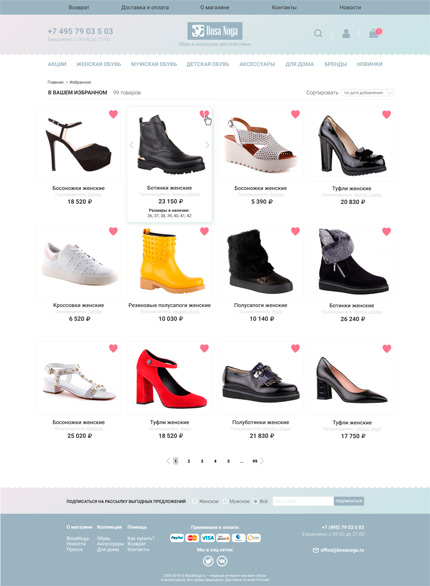
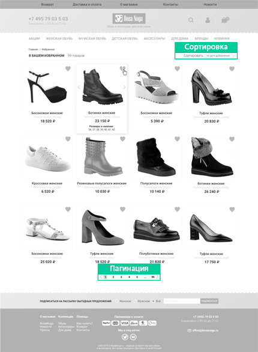
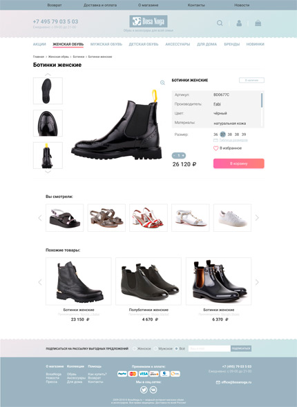
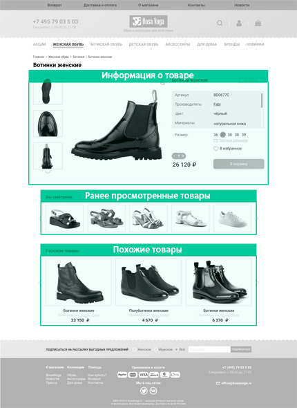
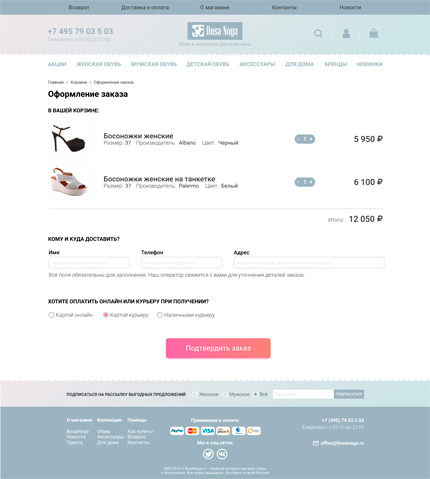

# Дипломный проект курса «Библиотека React»


Дипломный проект представляет собой интернет-магазин обуви. Задача заключается в создании работающего приложения, всеми основными функциями которого можно пользоваться.

## Содержание
Приложение содержит следующие самостоятельные экраны:

+ Главная страница;
+ Каталог товаров;
+ Избранное;
+ Страница товара;
+ Оформление заказа.

И встроенные экраны:
+ Товар;
+ Корзина покупок;
+ Поиск;
+ Подписка.

<!--## Переход между экранами
Переходы на встроенные экраны доступны на каждом самостоятельном экране:
1. «Корзина» | Переход осуществляется по клику на значок в форме корзины в шапке.
2. «Поиск» | По клику на значок в форме лупы в шапке.
3. «Подписка» | При заполнении формы подписки в подвале.

### Главная страница


С экрана «Главная страница» можно попасть на экраны:
1. «Каталог товаров», кликнув по одной из ссылок в шапке:

2. «Избранное», кликнув по иконке профиля в шапке, затем по ссылке «Избранное»: 

3. «Страница товара», кликнув по одному из товаров в блоке «Новинки».

### Каталог
На этот экран можно попасть с любого самостоятельного экрана, кликнув по одной из ссылок в шапке страницы.

С экрана «Каталог» можно попасть на следующие экраны: 
1. Вернуться обратно на «Главную страницу», кликнув по логотипу BosaNoga в шапке страницы.
2. «Избранное», кликнув по иконке профиля в шапке, затем по ссылке «Избранное».
3. «Страница товара», кликнув по одному из товаров.

### Избранное
На экран избранное можно попасть с любого самостоятельного экрана, кликнув по иконке профиля в шапке, затем по ссылке «Избранное».

С экрана «Избранное» можно попасть на следующие экраны: 
1. Вернуться обратно на «Главную страницу», кликнув по логотипу BosaNoga в шапке страницы.
2. «Избранное», кликнув по иконке профиля в шапке, затем по ссылке «Избранное».
3. «Страница товара», кликнув по одному из товаров.

### Страница товара
На этот экран можно попасть, кликнув на товар в любом из экранов. 

С экрана «Страница товара» можно попасть на следующие экраны:
1. Вернуться обратно на «Главную страницу», кликнув по логотипу BosaNoga в шапке страницы.
2. Вернуться в «Каталог товаров», кликнув по одной из ссылок в шапке.
3. «Избранное», кликнув по иконке профиля в шапке, затем по ссылке «Избранное».

### Оформление товара
На этот экран можно попасть только из встроенного экрана «Корзина», кликнув по кнопке «Оформить заказ»
   
С экрана «Оформление товара» можно:
1. Вернуться обратно на «Главную страницу», кликнув по логотипу BosaNoga в шапке страницы.
2. Вернуться в «Каталог товаров»:
3. Кликнув по одной из ссылок в шапке;
4. Кликнув по кнопке «Продолжить покупки» после успешного оформления товара. 
5. «Избранное», кликнув по иконке профиля в шапке, затем по ссылке «Избранное».-->

## Описание экранов

### Главная страница

Экран «Главная страница» доступен по умолчанию при открытии приложения.

[](./resources/main.png) [](./resources/images/des-desktop-full.jpg)

Этот экран содержит, в основном, описания акций и новостей, которые для нас не представляют особого интереса. 

Реализовать на этом экране нужно блок «Новинки»:



В блоке должны быть доступны возможности:
1. **Посмотреть все новинки**.  
Товары листаются с помощью стрелок вправо и влево.
2. **Добавить товар / товары в Избранное**  
Для добавления нужно кликнуть на сердечко в правом верхнем углу активного товара. При добавлении сердечко становится закрашенным.
3. **Убрать товар / товары из Избранного, если он был добавлен ранее**  
Чтобы убрать товар из избранного, нужно повторно кликнуть на сердечко. После этого сердечко снова становится белым.
4. **Перейти на страницу товара**  
Переход происходит по клику.

Получение списка новинок подробно описывается в разделе «Рекомендации по технической реализации» данного описания.

### Каталог товаров

На экран «Каталог товаров» можно попасть с любого самостоятельного экрана, кликнув по одной из ссылок в шапке страницы.

[](./resources/catalog.png) [](./resources/images/des-cat-full.jpg)

На экране «Каталог товаров» должны быть отображены все доступные товары в магазине. Товары отображаются постранично, на одной странице **15** товаров. Внизу страницы располагается пагинация.

На странице каталога должна быть доступна фильтрация товаров по следующим критериям:
+ Тип обуви (балетки, босоножки, ботильоны...);
+ Цена (диапазон цен);
+ Цвет;
+ Размер;
+ Размер каблука;
+ Повод (офис, вечеринка, свадьба);
+ Сезон;
+ Бренд;
+ Наличие скидки.

Все фильтры должно быть можно выключить, кликнув по кнопке «X Сбросить» внизу перечня фильтров.

Также должна быть доступна сортировка товаров по следующим критериям:
+ По популярности;
+ По размеру;
+ По производителю.

В отношении каждого из товаров доступны возможности, аналогичные таковым на главной странице:
1. **Добавить товар / товары в Избранное**  
Для добавления нужно кликнуть на сердечко в правом верхнем углу активного товара. При добавлении сердечко становится закрашенным.
2. **Убрать товар / товары из Избранного, если он был добавлен ранее**  
Чтобы убрать товар из избранного, нужно повторно кликнуть на сердечко. После этого сердечко снова становится белым.
3. **Перейти на страницу товара**  
Переход происходит по клику.

Получение списка новинок подробно описывается в разделе «Рекомендации по технической реализации» данного описания.

### Избранное

На экран «Избранное» можно попасть с любого самостоятельного экрана, кликнув по иконке профиля в шапке, затем по ссылке «Избранное».

[](./resources/favourites.png) [](./resources/images/des-fav-full.jpg)

На этом экране отображаются все товары, добавленные пользователем кликом по сердечку. Товары отображаются постранично, на одной странице **12** товаров. Внизу страницы также располагается пагинация.

Доступна сортировка товаров по следующим критериям:
+ По популярности;
+ По размеру;
+ По производителю.

В отношении каждого из товаров доступны возможности:
1. **Убрать товар / товары из Избранного, если он был добавлен ранее**  
Чтобы убрать товар из избранного, нужно повторно кликнуть на сердечко. После этого товар должен исчезнуть со страницы.
2. **Перейти на страницу товара**  
Переход происходит по клику.

### Страница товара

На экран «Страница товара» можно попасть, кликнув на товар в любом из экранов. 

[](./resources/item.png) [](./resources/images/des-item-full.jpg)

Главный блок данного экрана это «Информация о товаре», где отображается подробная информация о товаре, а именно:
1. Фотографии товара в формате галереи.
2. Наименование, Артикул, Производитель, Цвет, Материал, Сезон, Повод.
3. Доступные размеры.
4. Индикатор наличия.

В блоке «Информация о товаре» должны быть доступны следующие возможности:
1. **Добавить товар в Избранное**  
Для добавления нужно кликнуть по кнопке _«В избранное»_ под информацией о товаре. При добавлении сердечко кнопки становится закрашенным, а текст изменяется на _«В избранном»_
2. **Убрать товар из Избранного, если он был добавлен ранее**  
Чтобы убрать товар из избранного, нужно кликнуть по кнопке _«В избранном»_.
3. **Добавить товар в Корзину**  
Для добавления необходимо предварительно выбрать размер и количество товаров. Если размер не выбран, добавление товара в Корзину не происходит. Значения параметров по умолчанию: «Размер» — не имеет значения; Количество товаров — **1**.

Кроме информации о выбранном товаре на экране также есть два блока с информацией о других товарах:

1. Блок «Вы смотрели», где выводятся все товары (но не больше 10), страницы которых посетил пользователь во время текущей сессии.
2. Блок «Похожие товары», где выводятся товары, чей _Тип_ и _Цвет_ совпадают с _Типом_ и _Цветом_ текущего товара.

### Оформление заказа

На экран «Оформление заказа» можно попасть только из встроенного экрана «Корзина», кликнув по кнопке «Оформить заказ».

[](./resources/order.png) [](./resources/images/des-order-full.jpg)

На этом экране есть два основных блока:

1. Подробное отображение товаров, добавленных в «Корзину», а именно:
   + Наименование товара;
   + Фотография;
   + Выбранный размер;
   + Производитель;
   + Количество с возможностью его изменить;
   + Цена (изменяется в зависимости от количества).
2. «Форма заказа», в которой есть следующие элементы:
   + Поле для ввода имени покупателя;
   + Поле для ввода телефона;
   + Поле для ввода адреса;
   + Выбор формы оплаты (доступно 3 варианта: Картой онлайн, Картой курьеру, Наличными курьеру)
   + Кнопка подтверждения заказа.

Все поля в Форме заказа являются обязательными для заполнения.

При успешном подтверждении заказа блоки Корзина и Форма заказа сменяются блоком «Заказ принят, спасибо!». В блоке выводятся следующие данные:
1. Итог заказа:
   + Сумма всего заказа;
   + Выбранный способ оплаты;
   + Имя клиента;
   + Адрес доставки;
   + Телефон
2. Уведомление об отправке копии итога на электронную почту;
3. Предложение продолжить покупки (кнопка, нажатие на которую ведет на страницу Каталога товаров).

### Корзина покупок
Корзина покупок доступна на любом экране и реализуется в виде раздвижной панели в шапке сайта. Отображается по клику на значок корзины:


Если в корзину добавлено от одного до трёх товаров, скролл не отображается.

Если в корзине нет товаров, то отображается соответствующее уведомление:


На панели корзины доступны следующие возможности:
1. **Перейти на страницу товара**  
Переход происходит по клику.
2. **Убрать товар из корзины**  
Для этого нужно кликнуть на крестик справа от цены товара.
3. **Оформить заказ**  
Для этого необходимо кликнуть на кнопку «Оформить заказ». При клике происходит переход на экран «Оформление заказа».

### Поиск
На сайте должен быть реализован поиск по товарам. Поле для ввода поискового запроса доступно всегда в шапке страницы по клику на иконку в форме лупы. 

Страница вывода результатов поиска представляет собой страницу каталога, где выведены только товары, соответствующие запросу. Все функции страницы каталога (фильтры, сортировка, быстрый просмотр товара, добавление в избранное) доступны на этой странице. Изменяется только заголовок и «хлебные крошки»:


### Подписка
На сайте должна быть реализована подписка на выгодные предложения. Форма подписки доступна всегда в подвале страницы. Пользователь может выбрать между группами предложений (женские, мужские, общие) и оставить свой адрес электронной почты.

После того, как пользователь подписался на предложения, нужно показать уведомление об успешной подписке:


## Рекомендации по технической реализации

### Фильтры

Выбранные пользователем фильтры хранятся в состоянии приложения. При запросе списка товаров используются выбранные фильтры.

### Корзина

При добавлении товара в корзину в `localStorage` проверяется наличие идентификатора корзины, если он доступен, то запрос отправляется вместе в ним. В противном случае запрос отправляется без идентификатора, полученный ответ сохраняется в `localStorage`.

### Избранное

Список идентификаторов избранных товаров хранится в `localStorage`.

## Взаимодействие с сервером по HTTP

Для взаимодействия с серверной частью приложения вам доступно REST API по адресу:

https://neto-api.herokuapp.com/bosa-noga

### Получение списка категорий

` GET /categories` — получить информацию о категориях в JSON-формате.

В ответ приходит либо сообщение об ошибке, либо JSON-массив со списком категорий. Например:
```json
[
  {
    "id": 12,
    "title": "Детская обувь"
  },
  {
    "id": 13,
    "title": "Женская обувь"
  }
]
```

Тут:
- `id` — идентификатор категории на сервере, _число_;
- `title` — название категории, _строка_.

### Получение списка товаров

`GET /products` — получить информацию о товарах в JSON-формате.

В ответ приходит либо сообщение об ошибке, либо JSON-массив со списком товаров. Например:
```json
[
  {
    "id": 1,
    "title": "Босоножки женские",
    "image": "https://picsum.photos/200",
    "manufacturer": "Damlax",
    "price": 5950
  },
  {
    "id": 2,
    "title": "Туфли-кроссовки",
    "image": "https://picsum.photos/300",
    "manufacturer": "Reebok",
    "price": 12850
  }
]
```

Тут:
- `id` — идентификатор товара на сервере, _число_;
- `title` — название товара, _строка_;
- `image` — URL-адрес главного изображения товара, по которому оно доступно в сети, _строка_;
- `manufacturer` — производитель, _строка_;
- `price` — цена товара в рублях, _число_.

Данный метод поддерживает сортировку и фильтрацию, формат данных при отправке — `GET-параметры`. Необязательные поля для фильтрации и сортировки:

- `page` — номер страницы, _число_
- `type` — тип обуви (балетки, босоножки, ботильоны…), _строка_
- `color` — цвет обуви, _строка_
- `size` — размер обуви, _строка_
- `heelSize` — размер каблука, _строка_
- `reason` — повод (офис, вечеринка, свадьба), _строка_
- `season` — сезон, _строка_
- `brand` — бренд, _строка_
- `discounted` — наличие скидки, _логическое значение_
- `categoryId` — идентификатор категории, _число_
- `sortBy` — поле для сортировки, _строка_

### Получение новинок

`GET /featured` — получить информацию о новинках товаров в JSON-формате.

В ответ приходит либо сообщение об ошибке, либо JSON-массив со списком товаров. Например:
```json
[
  {
    "id": 1,
    "title": "Босоножки женские",
    "image": "https://picsum.photos/200",
    "manufacturer": "Damlax",
    "price": 5950
  },
  {
    "id": 2,
    "title": "Туфли-кроссовки",
    "image": "https://picsum.photos/300",
    "manufacturer": "Reebok",
    "price": 12850
  }
]
```

Структура ответа аналогична таковой при получении списка товаров.

### Получение информации о товаре

`GET /products/${id}` — получить информацию о товаре в JSON-формате. Тут `${id}` — идентификатор товара на сервере.

В ответ приходит либо сообщение об ошибке, либо JSON-объект с данными о товаре. Например:
```json
{
  "id": 12,
  "title": "Босоножки женские",
  "images": [
    "https://picsum.photos/200",
    "https://picsum.photos/300"
  ],
  "sku": "1333358811",
  "manufacturer": "Damlax",
  "color": "Синий",
  "material": "Натуральная кожа",
  "reason": "Офис",
  "season": "Лето",
  "heelSize": "12 см.",
  "sizes": [
    {
      "size": "12 US",
      "avalible": true
    },
    {
      "size": "15 US",
      "avalible": false
    }
  ]
}
```

Кроме полей, которые уже были описаны при получении списка товаров, еще некоторые свойства с ключами:
- `images` — URL-адреса изображений товара, по которому они доступны в сети, первое изображение считается главным, _массив строк_;
- `color` — цвет товара, _строка_;
- `material` — материал, из которого произведен товар, _строка_;
- `reason` — повод, по которому предполагается носить товар, _строка_;
- `season` — сезон, для которого подходит товар, _строка_;
- `heelSize` — размер каблука,
- `sizes` — информация о размерах и наличии их на складе, _массив объектов_.

Свойство `sizes`, которое хранит массив объетов со следующими свойствами:
- `size` — размер, _строка_;
- `avalible` — доступность размера на складе, _логическое значение_.

### Создание корзины

`POST /cart/` — создать новую корзину.

Формат данных при отправке `json-объект`. Пример запроса:
```json
{
  "id": 1,
  "size": "13 US",
  "amount": 1
}
```

Тут:
- `id` — идентификатор товара на сервере, _число_;
- `size` — размер товара, _строка_;
- `amount` — количество единиц товара, _число_.

Указанный товар будет добавлен в корзину.

В ответ приходит либо сообщение об ошибке, либо идентификатор корзины.

### Получение содержимого корзины

`GET /cart/${cartId}` — получить список товаров в корзине. Тут `${cartId}` — идентификатор корзины.

В ответ приходит либо сообщение об ошибке, либо JSON-объект с данными о товарах в корзине. Например:
```json
[
  {
    "id": 1,
    "size": "13 US",
    "amount": 1
  },
  {
    "id": 2,
    "size": "15 US",
    "amount": 2
  },
]
```

### Добавление, обновление и удаление товаров из корзины

`POST /cart/${cartId}` — изменить состав коризны. Тут `${cartId}` — идентификатор корзины.

Формат данных при отправке `json-объект`. Пример запроса:
```json
{
  "id": 1,
  "size": "13 US",
  "amount": 1
}
```

Тут:
- `id` — идентификатор товара на сервере, _число_;
- `size` — размер товара, _строка_;
- `amount` — количество единиц товара, _число_.

Указанный товар будет обновлен в корзине. Для удаления необходимо передать количество единиц товара равное нулю.

В ответ приходит либо сообщение об ошибке, либо идентификатор корзины.

### Создание заказа

`POST /order` — создать новый заказ.

Формат данных при отправке `json-объект`. Пример запроса:
```json
{
  "name": "Николай",
  "phone": "8 999 495 50 33",
  "address": "ул. Гоголя, 92",
  "paymentType": "onlineCard",
  "cart": "78535906-6300-11e8-adc0-fa7ae01bbebc"
}
```

Тут:
- `name` — имя заказчика, _строка_;
- `phone` — телефон заказчика, _строка_;
- `address` — адрес заказчика, _стркоа_;
- `paymentType` — способ оплаты, _строка, одно из_:
  - `onlineCard` — картой онлайн,
  - `offlineCard` — картой при получении,
  - `offlineCash` — наличными при получении;
- `cart` — идентификатор корзины, _строка_.

Возможные ответы:
- `201` — заказ успешно создан, в теле ответа идентификатор заказа;
- `400` — товара такого размера нет в наличии;
- `404` — ресурс не найден в теле ответа:
  - `sizeNotFound` — размер не найден,
  - `productNotFound` — товар не найден.