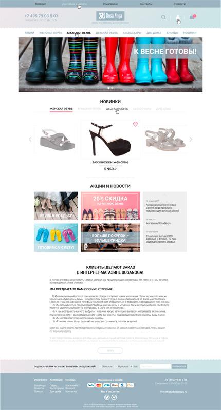
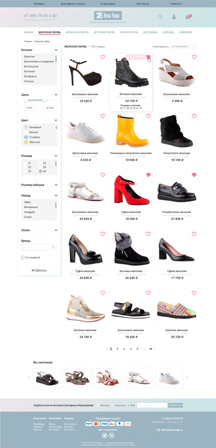
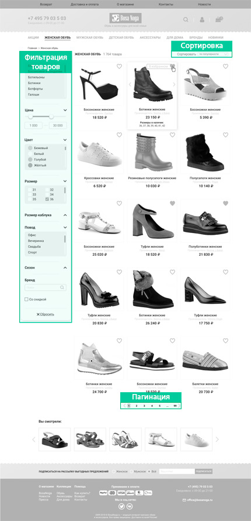

# Дипломный проект курса «Библиотека React»


Дипломный проект представляет собой интернет-магазин обуви. Задача заключается в создании работающего приложения, всеми основными функциями которого можно пользоваться.

## Содержание
Приложение содержит следующие самостоятельные экраны:

+ Главная страница;
+ Каталог товаров;
+ Избранное;
+ Страница товара;
+ Оформление заказа.

И встроенные экраны:
+ Товар;
+ Корзина покупок;
+ Поиск;
+ Подписка.

<!--## Переход между экранами
Переходы на встроенные экраны доступны на каждом самостоятельном экране:
1. «Корзина» | Переход осуществляется по клику на значок в форме корзины в шапке.
2. «Поиск» | По клику на значок в форме лупы в шапке.
3. «Подписка» | При заполнении формы подписки в подвале.

### Главная страница


С экрана «Главная страница» можно попасть на экраны:
1. «Каталог товаров», кликнув по одной из ссылок в шапке:

2. «Избранное», кликнув по иконке профиля в шапке, затем по ссылке «Избранное»: 

3. «Страница товара», кликнув по одному из товаров в блоке «Новинки».

### Каталог
На этот экран можно попасть с любого самостоятельного экрана, кликнув по одной из ссылок в шапке страницы.

С экрана «Каталог» можно попасть на следующие экраны: 
1. Вернуться обратно на «Главную страницу», кликнув по логотипу BosaNoga в шапке страницы.
2. «Избранное», кликнув по иконке профиля в шапке, затем по ссылке «Избранное».
3. «Страница товара», кликнув по одному из товаров.

### Избранное
На экран избранное можно попасть с любого самостоятельного экрана, кликнув по иконке профиля в шапке, затем по ссылке «Избранное».

С экрана «Избранное» можно попасть на следующие экраны: 
1. Вернуться обратно на «Главную страницу», кликнув по логотипу BosaNoga в шапке страницы.
2. «Избранное», кликнув по иконке профиля в шапке, затем по ссылке «Избранное».
3. «Страница товара», кликнув по одному из товаров.

### Страница товара
На этот экран можно попасть, кликнув на товар в любом из экранов. 

С экрана «Страница товара» можно попасть на следующие экраны:
1. Вернуться обратно на «Главную страницу», кликнув по логотипу BosaNoga в шапке страницы.
2. Вернуться в «Каталог товаров», кликнув по одной из ссылок в шапке.
3. «Избранное», кликнув по иконке профиля в шапке, затем по ссылке «Избранное».

### Оформление товара
На этот экран можно попасть только из встроенного экрана «Корзина», кликнув по кнопке «Оформить заказ»
   
С экрана «Оформление товара» можно:
1. Вернуться обратно на «Главную страницу», кликнув по логотипу BosaNoga в шапке страницы.
2. Вернуться в «Каталог товаров»:
3. Кликнув по одной из ссылок в шапке;
4. Кликнув по кнопке «Продолжить покупки» после успешного оформления товара. 
5. «Избранное», кликнув по иконке профиля в шапке, затем по ссылке «Избранное».-->

## Описание экранов

### Главная страница

Экран «Главная страница» доступен по умолчанию при открытии приложения.

[](./resources/Главная_Desktop.png) [](./resources/images/des-desktop-full.jpg)

Этот экран содержит, в основном, описания акций и новостей, которые для нас не представляют особого интереса. Реализовать на этом экране нужно блок «Новинки»:


В блоке должны быть доступны возможности:
1. Посмотреть все новинки  
(листая их с помощью стрелок вправо и влево).
2. Добавить товар в Избранное  
(кликнув на сердечко в правом верхнем углу активного товара).
3. Убрать товар из Избранного, если он был добавлен ранее  
(повторно кликнув на сердечко).
4. Перейти на страницу товара  
(кликнув на него).

Получение списка новинок подробно описывается в разделе «Рекомендации по технической реализации» данного описания.

### Каталог товаров

На экран «Каталог товаров» можно попасть с любого самостоятельного экрана, кликнув по одной из ссылок в шапке страницы.

[](./resources/Каталог_Desktop.png) [](./resources/images/des-cat-full.jpg)

На экране «Каталог товаров» должны быть отображены все доступные товары в магазине. Товары отображаются постранично, на одной странице 15 товаров.

На странице каталога должна быть доступна фильтрация товаров по следующим критериям:
+ Тип обуви (балетки, босоножки, ботильоны...);
+ Цена (диапазон цен);
+ Цвет;
+ Размер;
+ Размер каблука;
+ Повод (офис, вечеринка, свадьба);
+ Сезон;
+ Бренд;
+ Наличие скидки.

Все фильтры должно быть можно выключить, кликнув по кнопке «X Сбросить» внизу перечня фильтров.

Также должна быть доступна сортировка товаров по следующим критериям:
+ По популярности;
+ По размеру;
+ По производителю.

В отношении каждого из товаров доступны возможности:
1. Добавить товар в Избранное (кликнув на сердечко в правом верхнем углу активного товара).
2. Убрать товар из Избранного, если он был добавлен ранее (повторно кликнув на сердечко).
3. Перейти на страницу товара (кликнув на него)

### Избранное
На экране «Избранное» отображаются все товары, добавленные пользователем путём клика на сердечко. Товары отображаются постранично, на одной странице 12 товаров.

Доступна сортировка товаров по следующим критериям:
+ По популярности;
+ По размеру;
+ По производителю.

В отношении каждого из товаров доступны возможности:
1. Убрать товар из Избранного (кликнув на сердечко).
2. Перейти на страницу товара (кликнув на него)

### Страница товара
На экране «Страница товара» отображается подробная информация о товаре, а именно:
1. Фотографии товара в формате галереи.
2. Наименование, Артикул, Производитель, Цвет, Материал, Сезон, Повод.
3. Доступные размеры.
4. Индикатор наличия.

Кроме информации о выбранном товаре также есть два блока с информацией о других товарах:
«Вы смотрели», где выводятся все товары, карточки которых посетил пользователь.

«Похожие товары», где выводятся товары, чей Тип и Цвет совпадают.

На экране должны быть доступны следующие возможности:
1. Добавить товар в Избранное (кликнув по ссылке «В избранное»).
2. Добавить товар в Корзину, предварительно выбрав размер и количество товаров. Размер не имеет значения по умолчанию. Количество товаров по умолчанию равно 1.

### Оформление заказа
На экране «Оформление заказа» есть два основных блока:
1. Подробное отображение содержимого Корзины, а именно:
  + Наименование товара;
  + Фотография;
  + Выбранный размер;
  + Производитель;
  + Количество с возможностью его изменить;
  + Цена (изменяется в зависимости от количества).
2. Форма заказа, в которой есть следующие элементы:
  + Поле для ввода имени покупателя;
  + Поле для ввода телефона;
  + Поле для ввода адреса;
  + Выбор формы оплаты (доступно 3 варианта: Картой онлайн, Картой курьеру, Наличными курьеру)
  + Кнопка подтверждения заказа.

При успешном подтверждении заказа блоки с корзиной и формой заказа сменяются блоком «Заказ принят, спасибо!». Выводятся следующие данные:
1. Итог заказа:
  + Сумма всего заказа;
  + Выбранный способ оплаты;
  + Имя клиента;
  + Адрес доставки;
  + Телефон
2. Уведомление об отправке копии итога на электронную почту;
3. Предложение продолжить покупки (кнопка, нажатие на которую ведет на страницу Каталога товаров)

### Корзина покупок
Корзина покупок реализуется в виде раздвижной панели в шапке сайта и отображается по клику на значок корзины:


Если в корзину добавлено от одного до трёх товаров, скролл не отображается.

На панели корзины доступны следующие возможности:
1. Перейти на страницу товара (кликнув на него).
2. Убрать товар из корзины (кликнув на крестик справа от цены).
3. Оформить заказ (кликнув на соответствующую кнопку).

### Поиск
На сайте должен быть реализован поиск по товарам. Поле для ввода поискового запроса доступно всегда в шапке страницы по клику на иконку в форме лупы. 

Страница вывода результатов поиска представляет собой страницу каталога, где выведены только товары, соответствующие запросу. Все функции страницы каталога (фильтры, сортировка, быстрый просмотр товара, добавление в избранное) доступны на этой странице. Изменяется только заголовок и «хлебные крошки»:


### Подписка
На сайте должна быть реализована подписка на выгодные предложения. Форма подписки доступна всегда в подвале страницы. Пользователь может выбрать между группами предложений (женские, мужские, общие) и оставить свой адрес электронной почты.

После того, как пользователь подписался на предложения, нужно показать уведомление об успешной подписке:


## Рекомендации по технической реализации

### Фильтры

Выбранные пользователем фильтры храняться в состоянии приложения. При запросе списка товаров использубтся выбранные фильтры.

### Корзина

При добавлении товара в корзину в `localStorage` проверяется наличие идентификатора корзины, если он доступен, то запрос отправляется вместе в ним. В противном случае запрос отправляется без идентификатора, полученный ответ сохраняется в `localStorage`.

### Избранное

Список идентификаторов избранных товаров храниться в `localStorage`.

## Взаимодействие с сервером по HTTP

Для взаимодействии с серверной частью приложения вам доступно REST API по адресу:

https://neto-api.herokuapp.com/bosa-noga

### Получение списка категорий

` GET /categories` — получить инфомрацию о категориях в JSON-формате.

В ответ приходит либо сообщение об ошибке, либо JSON-массив со списком категорий. Например:
```json
[
  {
    "id": 12,
    "title": "Детская обувь"
  },
  {
    "id": 13,
    "title": "Женская обувь"
  }
]
```

Тут:
- `id` — идентификатор категории на сервере, _число_;
- `title` — название категории, _строка_.

### Получение списка товаров

`GET /products` — получить информацию о товарах в JSON-формате.

В ответ приходит либо сообщение об ошибке, либо JSON-массив со списком товаров. Например:
```json
[
  {
    "id": 1,
    "title": "Босоножки женские",
    "image": "https://picsum.photos/200",
    "manufacturer": "Damlax",
    "price": 5950
  },
  {
    "id": 2,
    "title": "Туфли-кроссовки",
    "image": "https://picsum.photos/300",
    "manufacturer": "Reebok",
    "price": 12850
  }
]
```

Тут:
- `id` — идентификатор товара на сервере, _число_;
- `title` — название товара, _строка_;
- `image` — URL-адрес главного изображения товара, по которому оно доступно в сети, _строка_;
- `manufacturer` — производитель, _строка_;
- `price` — цена товара в рублях, _число_.

Данный метод поддерживает сортировку и фильтрацию, формат данных при отправке — `GET-параметры`. Необязательные поля для фильтрации и сортировки:

- `page` — номер страницы, _число_
- `type` — тип обуви (балетки, босоножки, ботильоны…), _строка_
- `color` — цвет обуви, _строка_
- `size` — размер обуви, _строка_
- `heelSize` — размер каблука, _строка_
- `reason` — повод (офис, вечеринка, свадьба), _строка_
- `season` — сезон, _строка_
- `brand` — ренд, _строка_
- `discounted` — наличие скидки, _логическое значение_
- `categoryId` — идентификатор категории, _число_
- `sortBy` — поле для сортировки, _строка_

### Получение новинок

`GET /featured` — получить информацию о новинках товаров в JSON-формате.

В ответ приходит либо сообщение об ошибке, либо JSON-массив со списком товаров. Например:
```json
[
  {
    "id": 1,
    "title": "Босоножки женские",
    "image": "https://picsum.photos/200",
    "manufacturer": "Damlax",
    "price": 5950
  },
  {
    "id": 2,
    "title": "Туфли-кроссовки",
    "image": "https://picsum.photos/300",
    "manufacturer": "Reebok",
    "price": 12850
  }
]
```

Структура ответа аналогична получению списка товаров.

### Получение информации о товаре

`GET /products/${id}` — получить информацию о товаре в JSON-формате. Тут `${id}` — идентификатор товара на сервере.

В ответ приходит либо сообщение об ошибке, либо JSON-объект с данными о товаре. Например:
```json
{
  "id": 12,
  "title": "Босоножки женские",
  "images": [
    "https://picsum.photos/200",
    "https://picsum.photos/300"
  ],
  "sku": "1333358811",
  "manufacturer": "Damlax",
  "color": "Синий",
  "material": "Натуральная кожа",
  "reason": "Офис",
  "season": "Лето",
  "heelSize": "12 см.",
  "sizes": [
    {
      "size": "12 US",
      "avalible": true
    },
    {
      "size": "15 US",
      "avalible": false
    }
  ]
}
```

Кроме полей, которые были уже описаны при получении списка товаров, еще некоторые свойства с ключами:
- `images` — URL-адреса изображений товара, по которому они доступны в сети, первое изображение считается галвным, _массив строк_;
- `color` — цвет товара, _строка_;
- `material` — материал, из которого произведен товар, _строка_;
- `reason` — повод, по которому предполагается носить товар, _строка_;
- `season` — сезон, для которого подходит товар, _строка_;
- `heelSize` — размер каблука,
- `sizes` — информация о размерах и наличии их на складе, _массив объектов_.

Свойство `sizes`, которое хранит массив объетов со следующими свойствами:
- `size` — размер, _строка_;
- `avalible` — доступность размера на складе, _логическое значение_.

### Создание корзины

`POST /cart/` — создать новую корзину.

Формат данных при отправке `json-объект`. Пример запроса:
```json
{
  "id": 1,
  "size": "13 US",
  "amount": 1
}
```

Тут:
- `id` — идентификатор товара на сервере, _число_;
- `size` — размер товара, _строка_;
- `amount` — количество единиц товара, _число_.

Указанный товар будет добавлен в корзину.

В ответ приходит либо сообщение об ошибке, либо идентификатор корзины.

### Получение содержимого корзины

`GET /cart/${cartId}` — получить список товаров в корзине. Тут `${cartId}` — идентификатор корзины.

В ответ приходит либо сообщение об ошибке, либо JSON-объект с данными о товарах в корзине. Например:
```json
[
  {
    "id": 1,
    "size": "13 US",
    "amount": 1
  },
  {
    "id": 2,
    "size": "15 US",
    "amount": 2
  },
]
```

### Добавление, обновление и удаление товаров из корзины

`POST /cart/${cartId}` — изменить состав коризны. Тут `${cartId}` — идентификатор корзины.

Формат данных при отправке `json-объект`. Пример запроса:
```json
{
  "id": 1,
  "size": "13 US",
  "amount": 1
}
```

Тут:
- `id` — идентификатор товара на сервере, _число_;
- `size` — размер товара, _строка_;
- `amount` — количество единиц товара, _число_.

Указанный товар будет обновлен в корзине. Для удаления необходимо передать количество единиц товара равное нулю.

В ответ приходит либо сообщение об ошибке, либо идентификатор корзины.

### Создание заказа

`POST /order` — создать новый заказ.

Формат данных при отправке `json-объект`. Пример запроса:
```json
{
  "name": "Николай",
  "phone": "8 999 495 50 33",
  "address": "ул. Гоголя, 92",
  "paymentType": "onlineCard",
  "cart": "78535906-6300-11e8-adc0-fa7ae01bbebc"
}
```

Тут:
- `name` — имя заказчика, _строка_;
- `phone` — телефон заказчика, _строка_;
- `address` — адрес заказчика, _стркоа_;
- `paymentType` — способ оплаты, _строка, одно из_:
  - `onlineCard` — картой онлайн,
  - `offlineCard` — картой при получении,
  - `offlineCash` — наличными при получении;
- `cart` — идентификатор корзины, _строка_.

Возможные ответы:
- `201` — заказ успешно создан, в теле ответа идентификатор заказа;
- `400` — товара такого размера нет в наличии;
- `404` — ресурас не найдет, в теле ответа:
  - `sizeNotFound` — размер не найден,
  - `productNotFound` — товар не найден:
